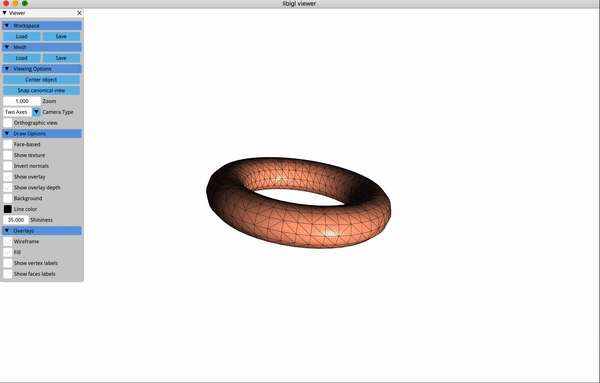

# Graphics Projects Catalog
A comprehensive catalog for all the previous graphics-related projects I have completed. Provide short summaries to individual topics and several previews on the respective implementations.

- [CSC417/CSC2549 Physics-based Animation](#csc417csc2549-physics-based-animation)
  - [Mass Spring in 1D](#mass-spring-in-1d)
  - [Mass Spring in 3D](#mass-spring-in-3d)
  - [Finite Element Method](#finite-element-method)
  - [FEM Cloth Simulation](#fem-cloth-simulation)
  - [Rigid Body Simulation](#rigid-body-simulation)
  - [Rigid Body with Collision](#rigid-body-with-collision)
- [CSC419/CSC2520 Geometry Processing](#csc419csc2520-geometry-processing)
  - [Mesh Representation](#mesh-representation)
  - [Mesh Reconstruction](#mesh-reconstruction)
  - [Registration](#registration)
  - [Smoothing](#smoothing)
  - [Deformation](#deformation)
  - [Parameterization](#parameterization)
  - [Curvature](#curvature)
- [Free Scope Research Topics](#free-scope-research-topics)
  - [Translucent Ray Tracing](#translucent-ray-tracing)
  - [Complementary Dynamics in 2D](#complementary-dynamics-in-2d)

## CSC417/CSC2549 Physics-based Animation
> Physically based animation is an area of interest within computer graphics concerned with the simulation of physically plausible behaviors at interactive rates. 
> 
> The course serves as an introduction to the field of physics-based animation by exposing underlying mathematical and algorithmic techniques required to understand 
> and develop efficient numerical simulations of physical phenomena such as rigid bodies, deformable bodies and fluids. 
  
### Mass Spring in 1D
**Summary (see details in [repo](https://github.com/TRDizer/CSC417_1d-mass-spring)):** 
Explore different numerical integration methods (forward euler, backward euler, runge-kutta, symplectic euler) in animating an 1D spring (aka. a mass-spring system with only 1 spring...).

**Preview:**\

### Mass Spring in 3D

**Summary (see details in [repo](https://github.com/TRDizer/CSC417_3d-mass-spring)):** 
Expand on the 1D scenario to animate meshes with mass-spring and backward euler integration.

**Preview:**\

### Finite Element Method
**Summary (see details in [repo](https://github.com/TRDizer/CSC417_finite-element-method)):** 
Robustly animate coarse simulation meshes with high "stiffness" using finite element method to drive the simulation of high resolution meshes with plausible real-time performance.

**Preview:**\

### FEM Cloth Simulation
**Summary (see details in [repo](https://github.com/TRDizer/CSC417_FEM-cloth)):** 
Animate cloth-like objects with collision using FEM.

**Preview:**\

### Rigid Body Simulation
**Summary (see details in [repo](https://github.com/TRDizer/CSC417_rigid-body)):** 
Animate an unconstrained rigid body in low gravity environment.

**Preview:**\

### Rigid Body with Collision
**Summary (see details in [repo](https://github.com/TRDizer/CSC417_rigid-body-collision)):** 
Expand on the previous premises for rigid body to encode collision into the simulation.

**Preview:**\

## CSC419/CSC2520 Geometry Processing
> Geometry processing, or mesh processing, is an area of research that uses concepts from applied mathematics, computer science and engineering to design efficient algorithms 
> for the acquisition, reconstruction, analysis, manipulation, simulation and transmission of complex 3D models.
>
> The course focuses on algorithms and mathematics behind fundamental operations for interpreting and manipulating geometric data. These essential tools enable: geometric modeling
> for computer aided design, life-like animations for computer graphics, reliable physical simulations, and robust scene representations for computer vision.

### Mesh Representation
**Summary (see details in [repo](https://github.com/TRDizer/CSC419_geometry-processing-introduction)):** 
Construct an edge matrix from a list of triangles and deduce the euler characteristic of the given triangle mesh.

**Preview:**\

### Mesh Reconstruction
**Summary (see details in [repo](https://github.com/TRDizer/CSC419_mesh-reconstruction)):** 
A simplified version of "Poisson Surface Reconstruction" by Kazhdan et al. 2006.

**Preview:**\

### Registration
**Summary (see details in [repo](https://github.com/TRDizer/CSC419_iterative-closest-point)):** 
Explore different models on capturing the distances between points from 2 meshes and compare their performance differences when used in iterative closest point algorithm on optimizing the rigid alignment of between surfaces.

**Preview:**\

### Smoothing
**Summary (see details in [repo](https://github.com/TRDizer/CSC419_surface-smoothing)):** 
Denoising meshes with implicit Laplacian smoothing.

**Preview:**\

### Deformation
**Summary (see details in [repo](https://github.com/TRDizer/CSC419_handle-based-deformation)):** 
Deform meshes with multi-handles constraint and modeling optimization goal using various metrics (Laplacian-based energy vs. Discrete as-rigid-as-possible energy).

**Preview:**\

### Parameterization
**Summary (see details in [repo](https://github.com/TRDizer/CSC419_surface-parametrization)):** 
Parameterization of 3D meshes with "least squares conformal" engey minimization.

**Preview:**\

### Curvature
**Summary (see details in [repo](https://github.com/TRDizer/CSC419_curvature)):** 
Identify the curvatures on an arbitrary mesh.

**Preview:**\

## Free Scope Research Topics

### Translucent Ray Tracing
**Summary (see details in [repo](https://gitfront.io/r/terria/47bf00e1cfa6f89b3b41b12c5ed1f344fea2e7ed/translucent-ray-tracing/)):** 
Augment Blinn-Phong shading model to handle refaction on transparent objects and out-going light blending.

**Preview:**\

### Complementary Dynamics in 2D
**Summary (see details in [repo](https://gitfront.io/r/terria/f70bc632a13acd02e512433e8fe77b3a310cd9db/CP_2D_Agumentation/)):** 
Animate 2D images with complementary dynamics according to real-time trajectory/displacement inputs from users.

**Preview:**\

