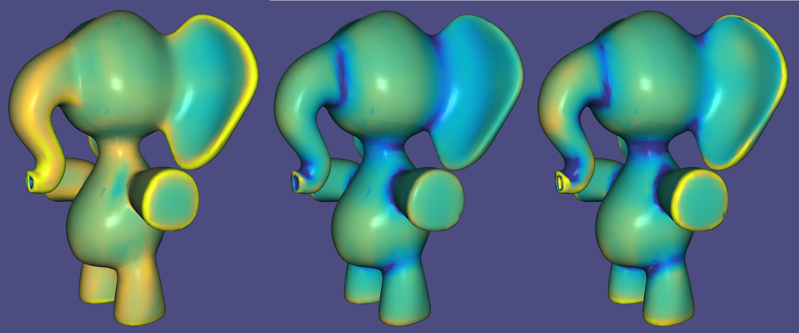

# Graphics Projects Catalog
A comprehensive catalog for all the previous graphics-related projects I have completed. Provide short summaries to individual topics and several previews on the respective implementations.

- [CSC417/CSC2549 Physics-based Animation](#csc417csc2549-physics-based-animation)
  - [Mass Spring in 1D](#mass-spring-in-1d)
  - [Mass Spring in 3D](#mass-spring-in-3d)
  - [Finite Element Method](#finite-element-method)
  - [FEM Cloth Simulation](#fem-cloth-simulation)
  - [Rigid Body Simulation](#rigid-body-simulation)
  - [Rigid Body with Collision](#rigid-body-with-collision)
- [CSC419/CSC2520 Geometry Processing](#csc419csc2520-geometry-processing)
  - [Mesh Representation](#mesh-representation)
  - [Mesh Reconstruction](#mesh-reconstruction)
  - [Registration](#registration)
  - [Smoothing](#smoothing)
  - [Deformation](#deformation)
  - [Parameterization](#parameterization)
  - [Curvature](#curvature)
- [Free Scope Research Topics](#free-scope-research-topics)
  - [Translucent Ray Tracing](#translucent-ray-tracing)
  - [Complementary Dynamics in 2D](#complementary-dynamics-in-2d)

## CSC417/CSC2549 Physics-based Animation
> Physically based animation is an area of interest within computer graphics concerned with the simulation of physically plausible behaviors at interactive rates. 
> 
> The course serves as an introduction to the field of physics-based animation by exposing underlying mathematical and algorithmic techniques required to understand 
> and develop efficient numerical simulations of physical phenomena such as rigid bodies, deformable bodies and fluids. 
  
### Mass Spring in 1D

### Mass Spring in 3D

### Finite Element Method

### FEM Cloth Simulation

### Rigid Body Simulation

### Rigid Body with Collision

## CSC419/CSC2520 Geometry Processing
> Geometry processing, or mesh processing, is an area of research that uses concepts from applied mathematics, computer science and engineering to design efficient algorithms 
> for the acquisition, reconstruction, analysis, manipulation, simulation and transmission of complex 3D models.
>
> The course focuses on algorithms and mathematics behind fundamental operations for interpreting and manipulating geometric data. These essential tools enable: geometric modeling
> for computer aided design, life-like animations for computer graphics, reliable physical simulations, and robust scene representations for computer vision.

### Mesh Representation

### Mesh Reconstruction

### Registration

### Smoothing

### Deformation

### Parameterization

### Curvature

## Free Scope Research Topics

### Translucent Ray Tracing

### Complementary Dynamics in 2D
